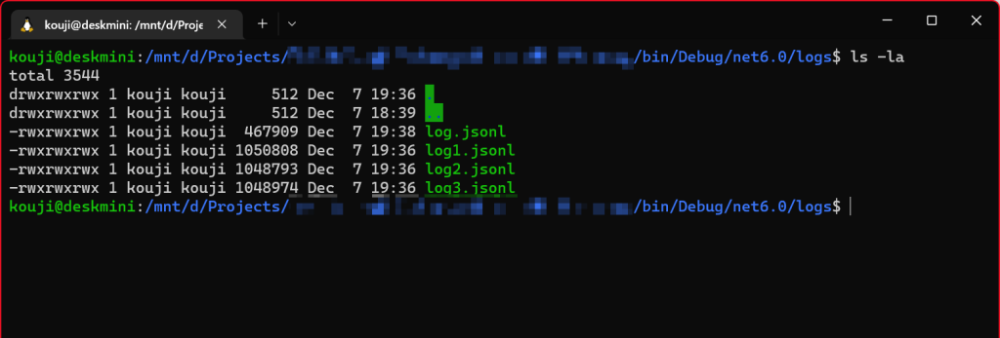

# ForestLog


ForestLog - A minimalist structuring logger interface, binds on Json Lines.

[](https://www.repostatus.org/#active)

## NuGet

Minimum packages:

| Package  | NuGet                                                                                                                |
|:---------|:---------------------------------------------------------------------------------------------------------------------|
| ForestLog | [](https://www.nuget.org/packages/ForestLog) |
| ForestLog.JsonLines | [](https://www.nuget.org/packages/ForestLog.JsonLines) |

3rd party logger binding:

| Package  | NuGet                                                                                                                |
|:---------|:---------------------------------------------------------------------------------------------------------------------|
| ForestLog.Extensions.Logging (ASP.NET Core) | [](https://www.nuget.org/packages/ForestLog.Extensions.Logging) |
| ForestLog.MQTTnet312 | [](https://www.nuget.org/packages/ForestLog.MQTTnet312) |

----

## What is this?

ForestLog is a log controller that outputs [Json Lines (`*.jsonl`) format.](https://jsonlines.org/)
The format is a de-facto to use continuous data stream, easy-to-use and sufficient.

Json Lines are line-separated Json format files that are easy to parse and suitable for recording continuous data.
Since the data is same as Json, it can handle structured data sets.
This means that arbitrary data can be added to the log output, and the log can be mechanically processed later.

```jsonc
{ "id": "12345", ... } [LF]
{ "id": "12346", ... } [LF]
{ "id": "12347", ... } [LF]
{ "id": "12348", ... } [LF]
// ...
```

ForestLog has taken into account that logs containing arbitrary data can be output very easily.
And we took care not to make log file configuration management too complicated to handle (Everything is programmable.)

It is also suitable for self-hosted applications, mobile applications,
and the 3rd party binding makes it easy to connect to ASP.NET Core and MQTTnet.
It would also be easy to combine with logging systems not included in the binding packages.

### Operating Environment

Core interface library:

* .NET 7, 6, 5
* .NET Core 3.1, 3.0, 2.2, 2.1, 2.0
* .NET Standard 2.1, 2.0, 1.6, 1.3
* .NET Framework 4.8, 4.6.1, 4.5, 4.0, 3.5

(Included Xamarin/MAUI platforms)

3rd party bridging interface:

* ASP.NET Core 1.0 or upper
* MQTTnet 3.1.2
  * Currently other versions is not supported, because they are contained breaking changes.

### Basic usage

Install [ForestLog](https://www.nuget.org/packages/ForestLog) and [ForestLog.JsonLines](https://www.nuget.org/packages/ForestLog.JsonLines) packages.

We need to create "Log controller" from the factory:

```csharp
using ForestLog;

// Construct log controller:
using ILogController logController = LogController.Factory.CreateJsonLines(
    // Output base directory path.
    "logs",
    // Minimum output log level.
    LogLevels.Debug);
```

Then, create a logger interface and ready to output:

```csharp
// Create logger:
ILogger logger = logController.CreateLogger();

// Write log entries:
var arg1 = 123;
var arg2 = 456;
logger.Debug($"Always using string interpolation: {arg1}");
logger.Trace($"Always using string interpolation: {arg2}");
```

Result in base directory `log.jsonl` (Json Lines format):

```jsonc
{
    "id": "0a913e2e-4ba7-4606-b703-2c9eccc9d217",
    "facility": "default",
    "logLevel": "debug",
    "timestamp": "2022-12-06T09:27:04.5451256+09:00",
    "scopeId": 1,
    "message": "Always using string interpolation: 123",
    "memberName": "PurchaseProductAsync",
    "filePath": "D:\\Projects\\AwsomeItemSite\\AwsomeItemSite.cs",
    "line": 229,
    "managedThreadId": 16,
    "nativeThreadId": 11048,
    "taskId": -1,
    "processId": 43608
}
{
    "id": "31b4709f-f7f5-45b5-9381-75f64e23efce",
    "facility": "default",
    "logLevel": "trace",
    "timestamp": "2022-12-06T09:27:04.5473678+09:00",
    "scopeId": 1,
    "message": "Always using string interpolation: 456",
    "memberName": "PurchaseProductAsync",
    "filePath": "D:\\Projects\\AwsomeItemSite\\AwsomeItemSite.cs",
    "line": 230,
    "managedThreadId": 16,
    "nativeThreadId": 11048,
    "taskId": -1,
    "processId": 43608
}
```

----

## Attach additional structured data

You can output with any additional instances:

```csharp
// Write log entry with additional data:
logger.Information($"See additional data below",
    new {
        Amount = 123,
        Message = "ABC",
        NameOfProduct = "PAC-MAN quarter",
    });
```

Result:

```jsonc
{
    "message": "See additional data below",
    "additionalData": {
        "amount": 123,
        "message": "ABC",
        "nameOfProduct": "PAC-MAN quarter"
    },
    // ...
}
```

The instance will be serialized by [NewtonSoft.Json](https://json.net/),
so you can use your existing knowledge to customize the Json representation.

----

## Attach any exceptions

The interfaces have feature for exception attachable:

```csharp
try
{
    throw new ApplicationException("Failed a operation.");
}
catch (Exception ex)
{
    // (There are also overloads that specify separate messages.)
    logger.Error(ex);
}
```

Result:

```jsonc
{
    "logLevel": "error",
    "message": "System.ApplicationException: Failed a operation.",
    "additionalData": {
        "name": "System.ApplicationException",
        "message": "Failed a operation.",
        "stackFrames": [
            "at AwsomeItemSite.Transaction.TransactAsync() at D:\\Projects\\AwsomeItemSite\\Transaction.cs:line 55"
        ],
        "innerExceptions": []
    },
    // ...
}
```

----

## Indicate explicit log level

The log level values are:

```csharp
// The lower symbol name is the most important.
// This order affects `MinimumOutputLogLevel` limitation.
public enum LogLevels
{
    Debug,       // |
    Trace,       // |
    Information, // |
    Warning,     // |
    Error,       // |
    Fatal,       // v Most important
    Ignore,      // <-- Will ignore any log output.
}
```

These values can be used to vary the log level:

```csharp
// Write log with log level variables:
var level1 = LogLevels.Debug;
logger.Log(level1, $"Debugging enabled.");

var level2 = LogLevels.Warning;
logger.Log(level2, $"Failed the transaction.");
```

----

## Annotates facility name

```csharp
// Create facility annoteted logger
var logger = logController.CreateLogger("DispatchController");

var unitCount = 5;
logger.Information($"Through the valid unit: Units={unitCount}");
```

Result:

```jsonc
{
    "facility": "DispatchController",
    "logLevel": "information",
    "message": "Through the valid unit: Units=5",
    // ...
}
```

----

## Awaited for exactly output

Normally, ForestLog outputs all log entries in the background context.
The use of an Awaitable method ensures that the log entries are actually output to a file.

```csharp
public async Task OutputAsync(ILogger logger)
{
    // We need to wait exactly output critical logs:
    await logger.InformationAsync($"Awaited to exactly output.");
}
```

----

## Delayed evaluation

We can use the `Func<T>` to delay the evaluation of the values to be included in the log:

```csharp
// If it needs a large cost to calculate:
logger.Information(
    $"Calculated total density: {() => this.CalculateDensity(123, 456)}");
```

* This expression is actually called when the log is output on worker thread context.
  It isn't evaluate when the log level is less than the output.
* This feature availables only C# 10 or upper compiler.

----

## Scoped output

The scoped output features will apply log entry relations with `scopeId` identity on log key.
And the time between entering and exiting the scope is then measured.

```csharp
public void Scope(ILogger parentLogger)
{
    parentLogger.TraceScope(logger =>
    {
        logger.Debug($"Output in child scope.");
        logger.Warning($"Same child scope.");
    });
}

public Task ScopeAsync(ILogger parentLogger)
{
    return parentLogger.TraceScopeAsync(async logger =>
    {
        logger.Debug($"Output in child scope.");
        logger.Warning($"Same child scope.");
    });
}
```

Result:

```jsonc
{
    "logLevel": "trace",
    "scopeId": 123,          // <-- Same scope id
    "parentScopeId": 42,     // <-- Parent logger scope id
    "message": "Enter.",
    // ...
}
{
    "logLevel": "debug",
    "scopeId": 123,          // <-- Same scope id
    "parentScopeId": 42,
    "message": "Output in child scope.",
    // ...
}
{
    "logLevel": "warning",
    "scopeId": 123,          // <-- Same scope id
    "parentScopeId": 42,
    "message": "Same child scope.",
    // ...
}
{
    "logLevel": "trace",
    "scopeId": 123,          // <-- Same scope id
    "parentScopeId": 42,
    "message": "Leave: Elapsed=00:00:00.00146248",
    // ...
}
```

The timestamp from `Enter` to `Leave` in the same `scopeId` can be used to calculate the time at tally time,
but elapsed time indicated in `Leave` message is even more precise.

Scope output can include arguments, return values and exception information:

```csharp
public string Scope(ILogger parentLogger, int a, double b, string c)
{
    // Using `new` operator with implicitly type `BlockScopeArguments`.
    return parentLogger.TraceScope(new(a, b, c), logger =>
    {
        return (a + b) + c;
    });
}
```

Result:

```jsonc
{
    "logLevel": "trace",
    "scopeId": 456, 
    "parentScopeId": 42, 
    "message": "Enter.",
    "additionalData": [
        111,
        222.333,
        "ABC"
    ],
    // ...
}
{
    "logLevel": "trace",
    "scopeId": 456, 
    "parentScopeId": 42, 
    "message": "Leave: Elapsed=00:00:00.00146248",
    "additionalData": "333.333ABC",
    // ...
}
```

When leave with exception:

```jsonc
{
    "logLevel": "trace",
    "scopeId": 456, 
    "parentScopeId": 42, 
    "message": "Leave with exception: Elapsed=00:00:00.00146248",
    "additionalData": {
        "name": "System.ApplicationException",
        "message": "Application might has invalid state..."
        "stackFrames": [
            "at AwsomeItemSite.Transaction.TransactAsync() at D:\\Projects\\AwsomeItemSite\\Transaction.cs:line 55"
        ],
        "innerExceptions": []
    },
    // ...
}
```

Alternatively, you can use `IDisposable` to define RAII-like scopes:

```csharp
public void Scope(ILogger parentLogger)
{
    using (var logger = parentLogger.TraceScope())
    {
        logger.Debug($"Output in child scope.");
        logger.Warning($"Same child scope.");
    }
}

public async Task ScopeAsync(ILogger parentLogger)
{
    using (var logger = await parentLogger.TraceScopeAsync())
    {
        logger.Debug($"Output in child scope.");
        logger.Warning($"Same child scope.");
    }
}
```

If you are familiar with the C# language, you may find this method easier to write.
However, that the logger does not record the contents of both the return value and exception details when it occurs.
(the "Leave" only message is recorded when the exception occurs and the scope is exited).

----

## Configure maximum log size and rotation

Will switch log file when current log file size is exceed.

```csharp
using var logController = LogController.Factory.CreateJsonLines(
    "logs",
    LogLevels.Debug,
    // Size to next file.
    1 * 1024 * 1024  // bytes
    );
```

Result:



The current log file to be appended is always `log.jsonl`.
When the file size is exceeded, it is renamed to a numbered file and a new `log.json` file is generated.

Enable log file rotation:

```csharp
using var logController = LogController.Factory.CreateJsonLines(
    "logs",
    LogLevels.Debug,
    1 * 1024 * 1024,
    // Maximum log files.
    10
    );
```

----

## Suspend and resume

In an environment such as smartphones and/or tablet devices,
log output must be suspended and resumed as the application transitions between states.

The following example will correspond to an application transition in Xamarin Android:

```csharp
public sealed class MainActivity
{
    private readonly ILogController logController =
        LogController.Factory.CreateJsonLines(...);

    public MainActivity()
    {
        DependencyService.RegisterSingleton<ILogController>(this.logController);
    }

    // ...

    protected override void OnPause()
    {
        // Suspend log controller.
        this.logController.Suspend();

        base.OnPause();
    }

    protected override void OnResume()
    {
        base.OnResume();

        // Resume log controller.
        this.logController.Resume();
    }
}
```

`Suspend()` method writes all queued log entries into the log files (will block while completed).
After that, any logging request will be ignored when before `Resume()` is called.

----

## Programmatically retreive log entries

Event to monitor log outputted in real time:

```csharp
logController.Arrived += (s, e) =>
{
    // This thread context is worker thread.
    // So you have to dispatch UI thread when using GUI frameworks.
    Console.WriteLine(e.LogEntry.ToString());
};
```

Or, perform quering and filtering by predicates from all logs recorded (including outputted to files):

```csharp
LogEntry[] importantLogs = await logController.QueryLogEntriesAsync(
    // Maximum number of log entries.
    100,
    // Filter function.
    logEntry => logEntry.LogLevel >= LogLevels.Warning);
```

----

## 3rd party logger binding

### ASP.NET Core binding configuration

Install [ForestLog.Extensions.Logging](https://www.nuget.org/packages/ForestLog.Extensions.Logging) package,
and configure using with `AddForestLog()` method extension:

```csharp
using ForestLog;

using var logController = LogController.Factory.CreateJsonLines(
    /* ... */);

var builder = WebApplication.CreateBuilder();

builder.WebHost.
    ConfigureLogging(builder => builder.AddForestLog(logController)).
    UseUrls("http://localhost/");

var webApplication = builder.Build();

// ...
```

* Or, you can use `builder.Services.AddForestLog()` directly.
* Yes, it is implemented for `Microsoft.Extensions.Logging` interfaces.
  So you can apply this package to ASP.NET Core, Entity Framework Core and any other projects.

### MQTTnet 3.1.2 binding configuration

Install [ForestLog.MQTTnet312](https://www.nuget.org/packages/ForestLog.MQTTnet312) package,
and uses `ForestLog.MqttNetLogger` class:

```csharp
using ForestLog;

using var logController = LogController.Factory.CreateJsonLines(
    /* ... */);

var mqttClient = new MqttFactory().
    CreateMqttClient(new MqttNetLogger(logController));
```

----

## Uses builtin awaitable value task (Advanced topic)

ForestLog has its own awaitable type, the `LoggerAwaitable` type.
This structure is a value-type likes the `ValueTask` type and allowing low-cost asynchronous operations.
(Yes, we can use these types on both `net35`, `net40` and `net45` tfms :)

It also defines an inter-conversion operator between the `Task` and `ValueTask` type,
allowing seamless use as follows:

```csharp
// Implicitly conversion from `Task`
async Task AsyncOperation()
{
    // ...
}

LoggerAwaitable awaitable = AsyncOperation();
await awaitable;
```

```csharp
// Implicitly conversion from `ValueTask`
async ValueTask AsyncOperation()
{
    // ...
}

LoggerAwaitable awaitable = AsyncOperation();
await awaitable;
```

```csharp
// Implicitly conversion from `Task<T>`
async Task<int> AsyncOperationWithResult()
{
    // ...
}

LoggerAwaitable<int> awaitable = AsyncOperationWithResult();
var result = await awaitable;
```

```csharp
// async-await operation
async LoggerAwaitable AsyncOperation()
{
    await Task.Delay(100);
}

await AsyncOperation();
```

```csharp
// async-await operation with result
async LoggerAwaitable<int> AsyncOperationWithResult()
{
    await Task.Delay(100);
    return 123;
}

var result = await AsyncOperationWithResult();
```

These `LoggerAwaitable` types are defined for the following reasons:

* Elimination of dependencies on assemblies containing `ValueTask` types.
* Elimination of complications due to inter-conversion between `Task` and `ValueTask` types.

For example, using the `LoggerAwaitable` type,
you can easily (simply) write and reduce asynchronous operation cost the following:

```csharp
// `TraceScopeAsync` method receives `Func<ILogger, LoggerAwaitable<int>>` delegate type
// and returns `LoggerAwaitable<int>` type.
public Task<int> ComplextOperationAsync() =>
    this.logger.TraceScopeAsync(async logger =>
    {
        // ...

        return result;
    });
```

Note: In `netcoreapp2.1` or later and `netstandard2.1`,
the `ValueTask` is not required any external dependencies.
So we can use `ValueTask` conversion naturally on these environments.

----

## Addendum

* Log file output is executed by worker thread,
  so synchronous versions of log output methods (such as `logger.Trace()`) always will not block.
  And the serialization process to Json is also performed within the worker thread.
  Care is taken to affect the thread that requested the log output as little as possible.
* In `net45` and higher environments, Json generation and output to file are performed in an asynchronous overlapping manner.
  Even if complex `Additional Data` structures are specified, the output to the file is less affected.
* Of course, there is no problem with reading logs (`logController.QueryLogEntriesAsync()`) during log output.
* ForestLog does not have any static log output methods.
  For example, methods like `StaticLogger.StaticTrace(...)`.
  We have seen many times that such static log output methods have disastrous results in application development iterations and integration projects.
  We recommend that instances of the `ILogger` interface be brought around in each implementation.

----

## License

Apache-v2.


## History

* 1.2.0:
  * Supported null logger interface and will ignore log writing when not avoids null checking.
* 1.1.0:
  * Added more scoping logger methods.
  * Fixed blocking at forced shutdown with TAE from another thread.
  * Added DisposeAsync on net45 or greater.
* 1.0.0:
  * Initial general release.
